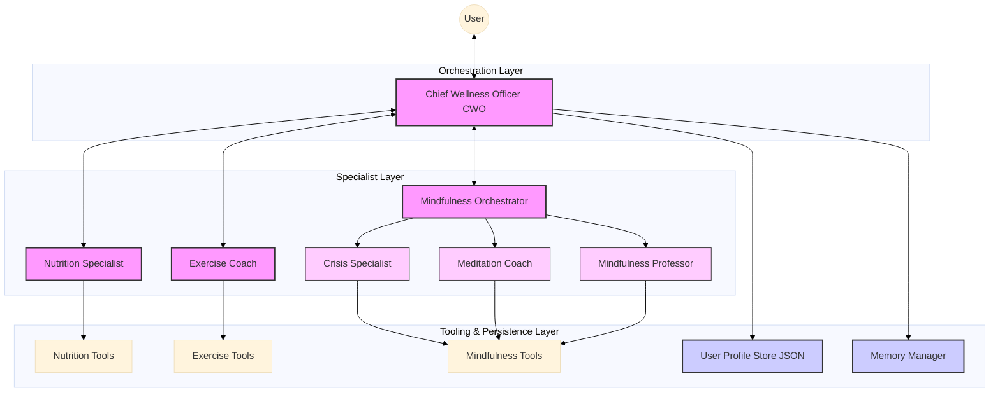

# AI Agent Fit Coach - Multi-Agent Wellness Orchestrator

**Personalized exercise, nutrition, and mindfulness planning powered by agentic AI.**

---

## 🌟 Overview

**Multi-Agent Wellness Orchestrator** is an intelligent system designed to deliver personalized, multi-dimensional wellness plans. Unlike generic tools, it uses a central **Chief Wellness Officer (CWO)** to coordinate specialized agents for **Exercise**, **Nutrition**, and **Mindfulness**.

The system remembers your history, adapts to your goals, and ensures safety, reducing the effort of wellness planning by hours each week.

### Key Features
*   **Persistent User Profiling**: Remembers age, weight, goals, and preferences.
*   **Long-term Memory**: Retains insights and adverse reactions across sessions.
*   **Multi-Agent Specialization**: dedicated experts for workouts, diets, and stress relief.
*   **Safety-First Logic**: Medically aware decision-making and risk assessment.
*   **Deployed on Agent Engine**: projects/137466749380/locations/us-central1/reasoningEngines/4897994448253747200
---

## 🎯 Problem & Solution

### The Problem
Users seeking wellness guidance often face fragmented advice across different domains (fitness apps, diet trackers, meditation tools). They lack a unified system that:

1.Remembers their personal context, history, and constraints over time.
2.Integrates physical and mental health advice into a single coherent plan.
3.Provides specialized, expert-level guidance without losing the "big picture" of the user's overall well-being.
4.Ensures safety by detecting crises (e.g., self-harm) and prioritizing immediate help over standard advice.


### The Solution
The solution is a Multi-Agent System centered around a Chief Wellness Officer (CWO).

1. The CWO serves as the single point of contact, maintaining a persistent User Profile (demographics, injuries, goals) and Long-Term Memory (past conversations, preferences).

2. It intelligently routes requests to three specialist agents:

* Exercise Coach: For workout programming.
* Nutrition Specialist: For dietary planning.
* Mindfulness Orchestrator: For mental health support.

3. The system synthesizes outputs from these specialists into unified, actionable advice, ensuring that a user's "knee injury" known by the CWO is respected by the Exercise Coach, and their "stress" is addressed by the Mindfulness agent.

---

## 🏗️ Architecture

The system follows a **Hub-and-Spoke** architecture with a shared context.



### Component Responsibilities

1.  **Chief Wellness Officer (CWO)** (Model: `gemini-2.5-flash`): The interface and decision hub. It gathers requirements, enforces safety, delegates to specialists, and synthesizes the final plan.
2.  **Specialists**:
    *   **Nutrition Specialist** (Model: `gemini-2.5-flash`): Calorie planning, dietary restrictions, meal templates.
    *   **Exercise Coach** (Model: `gemini-2.5-flash`): Workout routines, intensity adjustment, indoor/outdoor logic.
    *   **Mindfulness Orchestrator** (Model: `gemini-2.5-pro`): Orchestrates three sub-agents:
        *   **Crisis Specialist** (Model: `gemini-2.5-flash`): Detects self-harm/emergency context and provides safety resources.
        *   **Meditation Coach** (Model: `gemini-2.5-flash`): Guides specific practices (e.g., 4-7-8 breathing, grounding).
        *   **Mindfulness Professor** (Model: `gemini-2.5-flash`): Explains theory and concepts (e.g., neuroplasticity).
3.  **Persistence**:
    *   **Profile Store**: Structured data (age, weight, goals).
    *   **Memory Manager**: Episodic insights (e.g., "User felt dizzy after HIIT").

---

## 🚀 Setup & Usage

### Prerequisites
*   Python 3.10+
*   **GOOGLE_API_KEY**: Required to run the agent locally (set in `.env` file)
*   **Google Cloud Project**: Required for deployment
    *   `GOOGLE_CLOUD_PROJECT`: Your GCP project ID
    *   `GOOGLE_CLOUD_LOCATION`: Deployment region (e.g., `us-central1`)
    *   `GOOGLE_CLOUD_STAGING_BUCKET`: GCS bucket for staging (e.g., `gs://wellness-bucket-281125`)

### Running the Agent

There are two ways to run the wellness agent:

#### Option 1: ADK Web UI (Recommended for Interactive Use)

1.  **Navigate to the wellness directory**:
    ```bash
    cd wellness
    ```

2.  **Install dependencies**:
    ```bash
    pip install -r requirements.txt
    ```

3.  **Create a `.env` file** with your API key:
    ```bash
    GOOGLE_API_KEY=YOUR_API_KEY_HERE
    ```

4.  **Start the ADK Web UI**:
    ```bash
    adk web .
    ```
    *Then open the provided URL in your browser to interact with the agent.*

#### Option 2: Direct CLI Mode (For Testing & Development)

1.  **Set up environment** (from project root):
    ```bash
    pip install -r wellness/requirements.txt
    ```

2.  **Create `.env` file** in the `wellness` directory:
    ```bash
    GOOGLE_API_KEY=YOUR_API_KEY_HERE
    ```

3.  **Run the app**:
    ```bash
    cd wellness
    python app.py
    ```

### User Identity & Persistence

The system maintains **persistent state** for each user:

*   **Profile**: Stored in `data/user_profiles.json` (age, weight, goals, fitness level)
*   **Memories**: Stored in `data/user_memory.json` (past conversations, preferences, constraints)

**User ID Management**:
*   Set `WELLNESS_USER_ID` environment variable to specify a user (e.g., `alice`, `bob`)
*   If not set, a random ID is generated and stored in `data/user_id.txt`
*   Same user ID = same profile and memories across sessions

**Example**:
```bash
# Run as user "alice"
export WELLNESS_USER_ID=alice
python app.py
```

### Example Scenarios

#### Scenario A: New User - Exercise Goal
```bash
export WELLNESS_USER_ID=alice
python app.py
```
```
You > I want to reduce my arm fat
# CWO asks for: age, weight, gender, fitness level
You > 36, 54kg
You > female
You > beginner
# CWO routes to exercise_coach and generates personalized plan
```

#### Scenario B: Returning User
```bash
export WELLNESS_USER_ID=alice
python app.py
```
```
You > I want another workout plan
# CWO loads stored profile and memories, no need to re-ask demographics
```

#### Scenario C: Mindfulness & Crisis Support
```bash
export WELLNESS_USER_ID=bob
python app.py
```
```
You > I am stressed
# CWO routes to mindfulness_orchestrator → meditation_coach
```

For crisis scenarios (self-harm mentions), the system automatically routes to the **Crisis Specialist** for immediate safety resources.

---

## 🛠️ Deployment & Commands

This section contains commands to deploy, manage, and interact with the agent on Google Cloud.

**Note**: Run these commands from the **project root** (parent of `wellness/`).

### 1. List Deployments

**Without Poetry**:
```bash
PYTHONPATH=. python -m deployment.remote --list --project_id=gen-lang-client-0449050593 --location=us-central1 --bucket=gs://wellness-bucket-281125
```

**With Poetry**:
```bash
poetry run deploy-remote --list --project_id=gen-lang-client-0449050593 --location=us-central1 --bucket=gs://wellness-bucket-281125
```

### 2. Create a Remote Deployment

```bash
PYTHONPATH=. python -m deployment.remote --create --project_id=gen-lang-client-0449050593 --location=us-central1 --bucket=gs://wellness-bucket-281125
```

### 3. Manage Sessions

**Create a Session**:
```bash
PYTHONPATH=. python -m deployment.remote --create_session \
    --resource_id=projects/PROJECT/locations/LOCATION/agentEngines/RESOURCE_ID \
    --user_id=test_user \
    --project_id=gen-lang-client-0449050593 --location=us-central1 --bucket=gs://wellness-bucket-281125
```

**Send a Message**:
```bash
PYTHONPATH=. python -m deployment.remote --send \
    --resource_id=projects/PROJECT/locations/LOCATION/agentEngines/RESOURCE_ID \
    --session_id=SESSION_ID \
    --user_id=test_user \
    --message "Hello, can you give me a 3-day workout plan?" \
    --project_id=gen-lang-client-0449050593 --location=us-central1 --bucket=gs://wellness-bucket-281125
```

### 4. Cleanup (Delete Deployment)

```bash
PYTHONPATH=. python -m deployment.remote --delete \
    --resource_id=projects/PROJECT/locations/LOCATION/agentEngines/RESOURCE_ID \
    --project_id=gen-lang-client-0449050593 --location=us-central1 --bucket=gs://wellness-bucket-281125
```

---

## 📂 Project Links

*   **Repository**: [GitHub Link](https://github.com/vishalwankhede44/google_capstone_project)
*   **Video Demo**: [Youtube Link](https://youtu.be/QfQYalSUQpo)

---
*Built for the Google AI Agents Capstone.*
