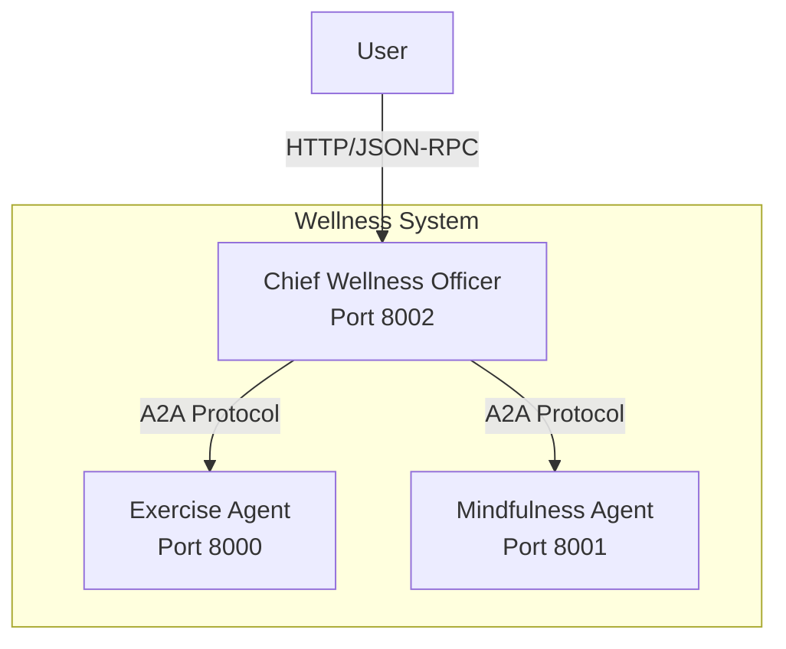

# A2A Protocol Implementation Guide

## Overview

This wellness application uses the **Agent-to-Agent (A2A) Protocol** to create a distributed multi-agent system. The **Chief Wellness Officer (CWO)** acts as the single entry point for the user, orchestrating requests to the **Exercise Agent** and **Mindfulness Agent**.

## Architecture



## Directory Structure

```
wellness/
├── chief_wellness_officer/   # [NEW] Orchestrator Agent
│   ├── __init__.py
│   ├── cwo_agent.py          # CWO Agent definition
│   ├── cwo_main.py           # A2A Server entry point (Port 8002)
│   └── cwo_tools.py          # Tools to call other agents
├── exercise_agent/           # Exercise Specialist
│   ├── __init__.py
│   ├── exercise_agent.py     # Exercise Agent definition
│   ├── exercise_main.py      # A2A Server entry point (Port 8000)
│   ├── exercise_tools.py
│   └── job_store.py
├── mindfullness_agent/       # Mindfulness Specialist
│   ├── __init__.py
│   ├── mindfulness_agent.py  # Mindfulness Agent definition
│   ├── mindfulness_main.py   # A2A Server entry point (Port 8001)
│   └── mindfulness_tools.py
├── requirements.txt
└── test_chat.py              # Updated to talk to CWO
```

## Running the System

You need to run **3 separate terminals** to start the full system.

### 1. Start Mindfulness Agent (Port 8001)
```bash
adk api_server --a2a --app mindfullness_agent.mindfulness_main:app_config --port 8001
```

### 2. Start Exercise Agent (Port 8000)
```bash
adk api_server --a2a --app exercise_agent.exercise_main:app_config --port 8000
```

### 3. Start Chief Wellness Officer (Port 8002)
```bash
adk api_server --a2a --app chief_wellness_officer.cwo_main:app_config --port 8002
```

## Testing

Run the test client, which now connects to the CWO on Port 8002:

```bash
python test_chat.py
```

### Example Interactions

**User**: "I want to build muscle."
**Flow**: User -> CWO -> Exercise Agent -> CWO -> User
**Result**: CWO provides a workout plan.

**User**: "I am feeling very anxious."
**Flow**: User -> CWO -> Mindfulness Agent -> CWO -> User
**Result**: CWO provides a grounding technique.

**User**: "I want to lose weight and reduce stress."
**Flow**: User -> CWO -> (Calls BOTH Exercise & Mindfulness Agents) -> CWO -> User
**Result**: CWO synthesizes a holistic plan.

## Troubleshooting

### Connection Refused
- Ensure all 3 agents are running on their respective ports.
- Check `cwo_tools.py` in `chief_wellness_officer` if you changed any ports.

### Agent Not Found
- Verify you installed `google-adk[a2a]`.
- Check the logs in the terminal of the specific agent that is failing.
